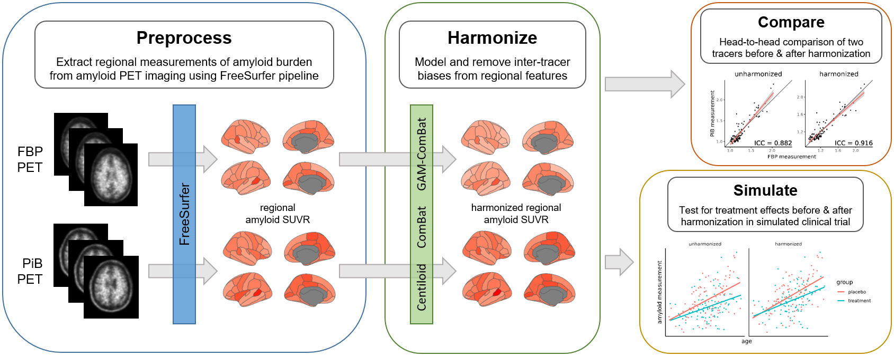
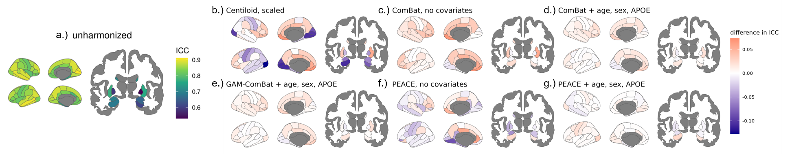

<!--- This markdown file was designed to roughly follow the Penn LINC Neuroinformatics template: https://pennlinc.github.io/docs/Contributing/ProjectTemplate/ --->

# Evaluation of ComBat harmonization for reducing across-tracer differences in regional amyloid PET analyses



<div style="background-color: white; display: inline-block; padding: 10px;">
    
</div>

## Project Description

This repository contains accompanying code for the manuscript "Evaluation of ComBat harmonization for reducing across-tracer differences in regional amyloid PET analyses".

## Corresponding Author

- [Braden Yang](mailto:b.y.yang@wust.edu)

## Principal Investigator

- [Aris Sotiras](mailto:aristeidis.sotiras@wustl.edu)

## Coauthors

- Tom Earnest
- Sayantan Kumar
- Deydeep Kothapalli
- Tammie Benzinger
- Brian Gordon

## Datasets

[Open Access Series of Imaging Studies 3 (OASIS-3)](https://sites.wustl.edu/oasisbrains/)

# Usage

## Download data from OASIS-3

This project relies on tabular data provided by the openly available OASIS-3 dataset. Data can be requested at https://sites.wustl.edu/oasisbrains/, and downloaded at https://www.nitrc.org/.

Once you get access to the dataset, follow these steps to download OASIS-3 tabular data:

1. Navigate to https://www.nitrc.org/, login to your account and go to "My Personal Page"
2. Under "My Tools/Resources", click on "OASIS-3: Longitudinal Multimodal Neuroimaging, Clinical, and Cognitive Dataset for Normal Aging and Alzheimer’s Disease" (this will appear once you successfully gain access to OASIS-3)
3. In the tabs on the left, click on "Image Repository"; this will take you to the portal to access and download data
4. Under the "Subjects" tab, click on "0AS_data_files" in the first row
5. Select "MR Session" for label "OASIS3_data_files"
6. Select all files and click download; this will start downloading a zip file named `OASIS3_data_files.zip`
7. Unzip this file

The downloaded folder will contain all necessary CSVs to run the current project. Store this in a convenient location and take note of its path.

## Install required packages

To run the project scripts, first ensure that you have **python 3.10** and **R 4.4.0** installed in your environment. Next, install the necessary packages for R and python.

To install the required python packages into your environment, create a new conda environment using the environment YAML file. The below command will create a new environment named `pet_harmonization`:

```
conda env create -f environment.yml -n pet_harmonization
```

Next, to install required R libraries, we will use the `renv` package. Start an R session from the repo directory (i.e. working directory = repo directory) and install `renv` from the R terminal:

```
install.packages("renv")
```

Then install the required packages using the following command, again from the R terminal:

```
renv::restore()
```

You can optionally specify the path to the repo directory via the "project" argument, in case the current working directory isn't the repo.

> NOTE: Certain R packages like `xml2` cannot install if conda is active (see [github issue](https://github.com/r-lib/xml2/issues/357)). So before running `renv::restore()`, be sure to deactivate conda by running `conda deactivate` on the terminal.

## Set parameters

Edit `params.json` to specify your particular parameters:

- `"OASIS_paths"`: replace `/path/to/OASIS3_data_files` to the absolute path to wherever you stored the "OASIS3_data_files" folder that you downloaded from NITRC; keep everything after this path unchanged
- `"n_simulation"`: number of simulations to run in simulation experiment

## Run example script

To run the example script, change to the repo directory, then run the following:

```
bash code/run_project.sh
```

This will run steps `0_GetData`, `1_Harmonize` and `2_HeadToHead` to completion and generate data and figures that are the same as those that appear on the paper. Step `3_Simulation` runs a for loop to handle all configurations of tracer proportions and treatment effects, with a default `n_simulation = 10`. To recreate the results in the paper (using 1000 iterations), it is recommended to call multiple compute jobs to handle each configuration separately, rather than run the entire for loop on a single thread.

# Cite

Accepted to *Human Brain Mapping*; citation coming soon.
